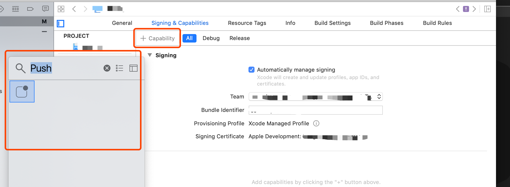
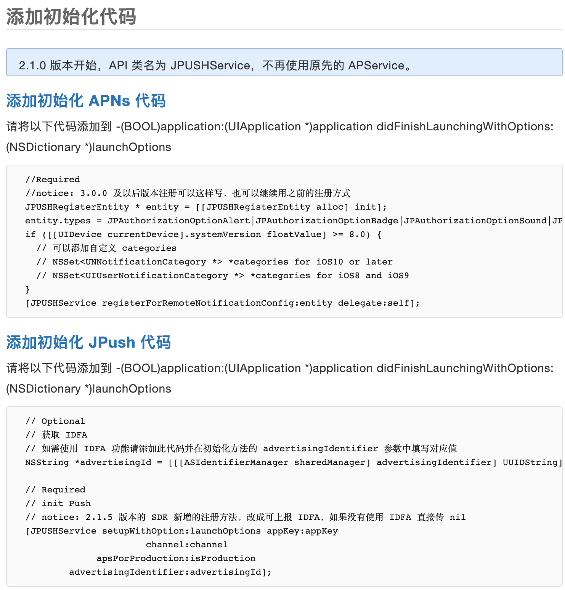

### ios 推送集成

https://docs.jiguang.cn//jpush/client/iOS/ios_guide_new/

#### 导入 SDK

```js
pod 'JCore' // 可选项，也可由pod 'JPush'自动获取
pod 'JPush' // 必选项
//安装指定版本
pod 'JCore', '2.1.4'    // 可选项，也可由pod 'JPush'自动获取
pod 'JPush', '3.2.6'    // 必选项
注：如果无法导入最新版本，请执行 pod repo update master 这个命令来升级本机的 pod 库，然后重新 pod 'JPush'
```

如使用 Xcode 8 及以上环境开发，请开启 Application Target 的 Capabilities->Push Notifications 选项，如图


全局配置 info.plist

```JS
<key>NSAppTransportSecurity</key>
<dict>
  <key>NSAllowsArbitraryLoads</key>
  <true/>
</dict>
```

```JS
// 引入 JPush 功能所需头文件
#import "JPUSHService.h"
// iOS10 注册 APNs 所需头文件
#ifdef NSFoundationVersionNumber_iOS_9_x_Max
#import <UserNotifications/UserNotifications.h>
#endif
// 如果需要使用 idfa 功能所需要引入的头文件（可选）
#import <AdSupport/AdSupport.h>
```

##### AppDelegate

```js
@interface AppDelegate ()<JPUSHRegisterDelegate>
@end
```



#### AppDelegate.m

```js
- (void)application:(UIApplication *)application
didRegisterForRemoteNotificationsWithDeviceToken:(NSData *)deviceToken {
  /// Required - 注册 DeviceToken
  [JPUSHService registerDeviceToken:deviceToken];
}
- (void)application:(UIApplication *)application didFailToRegisterForRemoteNotificationsWithError:(NSError *)error {
  //Optional
  NSLog(@"did Fail To Register For Remote Notifications With Error: %@", error);
}
// iOS 12 Support
- (void)jpushNotificationCenter:(UNUserNotificationCenter *)center openSettingsForNotification:(UNNotification *)notification{
  if (notification && [notification.request.trigger isKindOfClass:[UNPushNotificationTrigger class]]) {
    //从通知界面直接进入应用
  }else{
    //从通知设置界面进入应用
  }
}
// iOS 10 Support
- (void)jpushNotificationCenter:(UNUserNotificationCenter *)center willPresentNotification:(UNNotification *)notification withCompletionHandler:(void (^)(NSInteger))completionHandler {
  // Required
  NSDictionary * userInfo = notification.request.content.userInfo;
  if([notification.request.trigger isKindOfClass:[UNPushNotificationTrigger class]]) {
    [JPUSHService handleRemoteNotification:userInfo];
  }
  completionHandler(UNNotificationPresentationOptionAlert); // 需要执行这个方法，选择是否提醒用户，有 Badge、Sound、Alert 三种类型可以选择设置
}
// iOS 10 Support
- (void)jpushNotificationCenter:(UNUserNotificationCenter *)center didReceiveNotificationResponse:(UNNotificationResponse *)response withCompletionHandler:(void (^)())completionHandler {
  // Required
  NSDictionary * userInfo = response.notification.request.content.userInfo;
  if([response.notification.request.trigger isKindOfClass:[UNPushNotificationTrigger class]]) {
    [JPUSHService handleRemoteNotification:userInfo];
  }
  completionHandler();  // 系统要求执行这个方法
}
- (void)application:(UIApplication *)application didReceiveRemoteNotification:(NSDictionary *)userInfo fetchCompletionHandler:(void (^)(UIBackgroundFetchResult))completionHandler {
  // Required, iOS 7 Support
  [JPUSHService handleRemoteNotification:userInfo];
  completionHandler(UIBackgroundFetchResultNewData);
}
- (void)application:(UIApplication *)application didReceiveRemoteNotification:(NSDictionary *)userInfo {
  // Required, For systems with less than or equal to iOS 6
  [JPUSHService handleRemoteNotification:userInfo];
}
```

[CPushManager.h 下载](../../assets/files//CPushManager.h)

[CPushManager.m 下载](../../assets/files//CPushManager.m)
